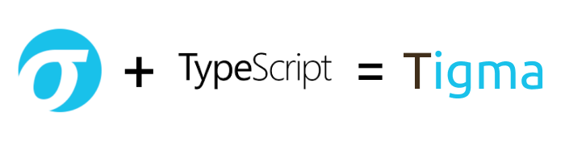

# Tigma
Tigma is a fully compliant library for loading, parsing, and validating Sigma rules in a JS environment (browser or node). This enables Sigma to reach even further by opening up new platforms supporting Javascript (almost anything out there). 

The library is compliant with original Sigma Language specification and doesn't have anything custom (at least for now).

## How does it work?
At its core, it converts Sigma Rule to an Abstract Syntax Tree (AST) of Identifier objects which makes it easier to implement backends. 

The only available backend, for now, is the "Sigma JSON Scanner" which is the main reason for developing this library.
 
## Tigma: Empowering DFIR with Sigma
As you already know, Sigma is a SIEM oriented language which is easy to read/write and share which made it receive a high adoption rate in a short period of time. This is great but wouldn't it better to scan a full JSON file such as the forensic state of the endpoint captured at a specific time? We asked this question some time ago and the answer was obviously YES!

If you are curious about what does "scanning the forensic state of an endpoint" mean check the example below:

Example Rule:
```yaml
title: Some Rule
description: Just a sample for demonstration
...
detection:
  selection:
    Process:
      Name: 
        - a.exe
        - b.exe
      DigitalSignature:
        Publisher: Ultimate APT Company
    Autoruns:
      RootKey: HKLM
      KeyPath: Software\Wow6432Node\APT\Auto
    Prefetch:
      Name|endswith: 'katz.exe'
    TCPTable:
      TargetIP: 
        - 171.13.209.82
        - 171.13.209.83
  condition: selection
```

Now you know why it is cool :) Think about sharing these type of "contextful signatures" for scanning against an endpoint locally or its captured state such as the one created by [Binalyze IREC](http://binalyze.com/products/irec) / [AIR](http://binalyze.com/products/air).

## How to start?
```
git clone https://github.com/binalyze/tigma.git
cd tigma
npm install
npm run start:dev
```
Now you can visit [Tigma Playground (localhost)](http://localhost:8080/public/main.html) for seeing Tigma in action.

## Live Demo


## Work in progress
 - [X] Implement full support for modifiers
 - [ ] Improve playground page
 - [ ] Implement support for aggregation
 - [ ] Implement support for YAML multiple documents
 
 ## Credits
 Special thanks go to the creators of Sigma and all contributors starting with:
 - [Thomas Patzke](https://github.com/thomaspatzke)
 - [Florian Roth](https://github.com/Neo23x0)
